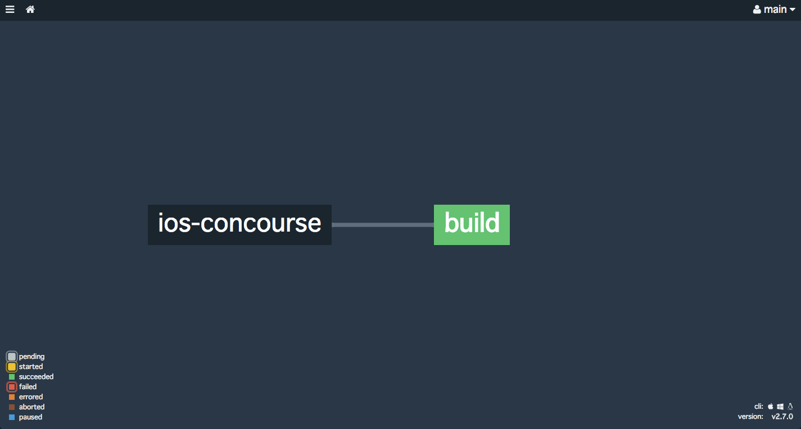

# ios-concourse

Building iOS application using [Concourse CI](https://concourse.ci/) 

## Build

first, clone this repo.

```bash
$ ssh-keygen -t rsa -f ./keys/web/tsa_host_key -N ''
$ ssh-keygen -t rsa -f ./keys/web/session_signing_key -N ''
$ ssh-keygen -t rsa -f ./keys/worker/worker_key -N ''
$ cp ./keys/worker/worker_key.pub ./keys/web/authorized_worker_keys
$ cp ./keys/web/tsa_host_key.pub ./keys/worker
$ ssh-keygen -t rsa -f ./keys/worker/darwin_worker_key -N ''
$ cat ./keys/worker/darwin_worker_key.pub >> ./keys/web/authorized_worker_keys
$ export DEV_PORTAL_TEAM_ID=YOUR_TEAM_ID
```

Start Concourse CI.

```bash
$ docker-compose up
```

Start Darwin worker.

```bash
$ sudo concourse worker --work-dir /opt/concourse/worker --tsa-host 127.0.0.1 --tsa-public-key ./keys/worker/tsa_host_key.pub --tsa-worker-private-key ./keys/worker/darwin_worker_key
```

Set pipleline.

```bash
$ cd ExampleForConcourse
$ fly -t ci login -c http://127.0.0.1:8080/
$ fly -t ci set-pipeline -p ios-concourse -c concourse.yml
$ fly -t ci unpause-pipeline -p ios-concourse
```


